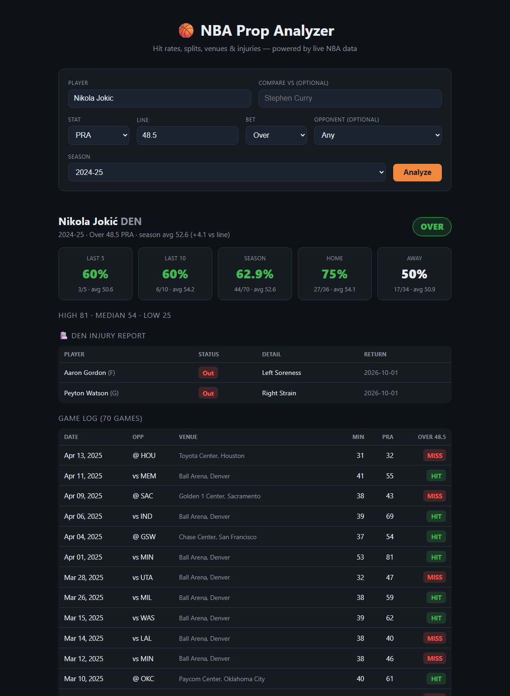

# 🏀 NBA Prop Analyzer

A web app that analyzes NBA player prop bets using **live game data**. Enter a
player, a stat, and a betting line — it returns hit rates over recent windows,
home/away splits, a full game log, and a recommended lean (Over / Under / Pass).

This is how real prop research tools (PropFinder, Outlier) work: instead of
guessing, you see how often a player has actually cleared a line.



> ⚠️ Educational / portfolio project. **Not betting advice.**

---

## Features

- 🔎 **Player search** with live autocomplete (active NBA players)
- 📊 **Hit rates** over last 5, last 10, and the full season
- 🏠 **Home vs. away splits** — often the difference on a prop
- 🗓️ **Season selector** — analyze any season from 2020-21 to 2025-26
- 🆚 **Opponent splits** — filter to "how does he do vs. this team?"
- ⚔️ **Player comparison** — two players head-to-head on the same line, winner highlighted
- 📍 **Per-game venue** — arena and city for every game in the log
- 🏥 **Team injury report** — live from ESPN (nba_api has no injury feed)
- 🎯 **Combo stats**: PTS, REB, AST, STL, BLK, 3PM, TOV, plus PRA / PR / PA / RA
- 📈 **Game log** with every game marked HIT or MISS against the line
- 🤖 **Lean engine** weighting recent form and the average-vs-line margin
- ✅ **Unit-tested** prop engine (`pytest`)
- 🖥️ Also includes the original **command-line tool** for quick game-log lookups

---

## Tech stack

| Layer    | Tech                          |
|----------|-------------------------------|
| Data     | [nba_api](https://github.com/swar/nba_api) (live NBA.com stats) |
| Backend  | FastAPI + Uvicorn             |
| Frontend | Vanilla HTML/CSS/JS (no build step) |
| CLI      | Python + tabulate             |

---

## Project structure

```
.
├── src/
│   ├── nba_stats.py    # player lookup (accent-insensitive) + game-log engine
│   ├── props.py        # prop hit-rate / splits / venue / lean engine
│   ├── teams.py        # 30-team reference (arenas, cities, names)
│   └── injuries.py     # ESPN injury feed (best-effort, graceful fallback)
├── api/
│   └── app.py          # FastAPI backend + serves the frontend
├── web/
│   ├── index.html      # single-page UI
│   ├── style.css       # dark sportsbook theme
│   └── app.js          # fetches the API, renders results
├── tests/
│   └── test_props.py   # pytest suite (no network — synthetic game logs)
├── main.py             # original CLI tool
├── requirements.txt
└── README.md
```

---

## Setup

Requires **Python 3.11+**.

```bash
pip install -r requirements.txt
```

---

## Run the web app

```bash
python -m uvicorn api.app:app --reload
```

Then open **http://127.0.0.1:8000** in your browser.

Type a player (e.g. *Nikola Jokic*), pick a stat (e.g. *PRA*), enter a line
(e.g. *48.5*), choose Over/Under, and hit **Analyze**.

### Shareable links

Analyses are linkable — the app auto-runs from URL query params, so you can
share a specific prop directly:

```
http://127.0.0.1:8000/?player=Nikola+Jokic&stat=PRA&line=48.5
http://127.0.0.1:8000/?player=LeBron+James&compare=Stephen+Curry&stat=PTS&line=24.5
```

---

## Run the CLI (bonus)

Quick last-10 game log for any player:

```bash
python main.py "LeBron James"
```

---

## API reference

| Endpoint                                             | Description                       |
|------------------------------------------------------|-----------------------------------|
| `GET /api/stats`                                     | Supported stat keys               |
| `GET /api/seasons`                                   | Selectable seasons + default      |
| `GET /api/teams`                                     | Team abbreviations + names        |
| `GET /api/players?q=leb`                             | Player autocomplete               |
| `GET /api/analyze?player=...&stat=PTS&line=24.5&over=true&opponent=BOS&season=2024-25` | Full prop analysis (opponent + season optional) |
| `GET /api/compare?player_a=...&player_b=...&stat=PTS&line=24.5&over=true&season=2024-25` | Two players head-to-head |
| `GET /api/injuries?team=LAL`                         | Team injury report (via ESPN)     |

Example:

```bash
curl "http://127.0.0.1:8000/api/analyze?player=LeBron+James&stat=PTS&line=24.5&over=true"
```

## Deploying live (free)

The app is ready to deploy as-is. Config files included:

- `render.yaml` — [Render](https://render.com) Blueprint (recommended, free tier)
- `Procfile` + `runtime.txt` — works on Railway, Heroku-style platforms

### Deploy to Render (recommended)

1. Push this repo to GitHub (see above).
2. Go to [dashboard.render.com](https://dashboard.render.com) → **New +** → **Blueprint**.
3. Connect your GitHub and select this repo. Render reads `render.yaml`
   automatically — name, build command, start command, and Python version are
   all preconfigured.
4. Click **Apply**. First build takes a few minutes (installs numpy/pandas).
5. You get a public URL like `https://nba-prop-analyzer.onrender.com`.

> Free-tier services sleep after ~15 min idle and take ~30s to wake on the next
> request. Fine for a portfolio demo.

The production start command (used by every platform) is:

```bash
uvicorn api.app:app --host 0.0.0.0 --port $PORT
```

## Running the tests

```bash
python -m pytest tests/ -q
```

The suite feeds synthetic game logs into the pure analysis functions, so it
runs offline and fast — no NBA API calls.

## A note on the injury feed

`nba_api` does not provide injuries, so the injury report is pulled from
ESPN's public endpoint as a best-effort feature. If ESPN is unreachable or
changes its format, the app degrades gracefully ("Injury report unavailable")
rather than erroring. Injuries are **current**, while game-log stats reflect
the configured season — so during the offseason you'll see live injury news
alongside last season's stats.

---

## How the "lean" is calculated

The recommendation blends recent and season-long hit rates, then checks the
average-vs-line margin:

```
score = 0.6 * (last-10 hit rate) + 0.4 * (season hit rate)

score ≥ 60 and avg above line  → OVER
score ≤ 40 and avg below line  → UNDER
otherwise                      → PASS
```

This is intentionally transparent and easy to tune — see `_lean()` in
[`src/props.py`](src/props.py).

---

## Roadmap (future / monetization ideas)

- [ ] Opponent-specific splits (vs. this team / vs. defensive rank)
- [ ] Multi-season trends and rest-day (back-to-back) splits
- [ ] Cache responses (Redis) to speed up repeat lookups
- [ ] Deploy live (Render / Railway / Fly.io)
- [ ] User accounts + saved players (Free vs. Pro tier with Stripe)
- [ ] Daily slate view: today's games and auto-pulled prop lines

---

## Disclaimer

Data is sourced from the public NBA.com stats API and may be delayed or
incomplete. This project is for educational purposes and is **not** affiliated
with the NBA. Nothing here is betting advice.
